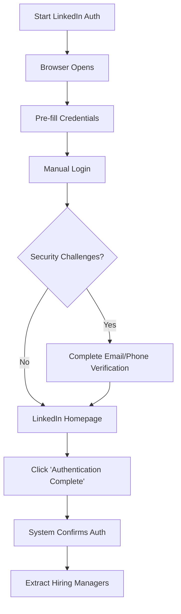

# 🔐 Interactive LinkedIn Authentication Guide

## Overview

The Interactive LinkedIn Authentication system allows you to manually complete LinkedIn login in a browser window while the dashboard waits for your confirmation. This approach handles complex security challenges like email verification, captcha, and two-factor authentication.

## How It Works

### 🌐 **Browser-Based Authentication**
1. **Browser Opens**: System opens a Chrome browser window with LinkedIn login page
2. **Pre-filled Form**: Your credentials are automatically filled in (if provided)
3. **Manual Completion**: You manually click "Sign in" and handle any security challenges
4. **Dashboard Confirmation**: You click "Authentication Complete" in the dashboard to proceed

### 🔄 **Workflow**



## Step-by-Step Instructions

### 1. **Configure Credentials**

Add to your `.env` file:
```bash
LINKEDIN_EMAIL=your.email@example.com
LINKEDIN_PASSWORD=your_password
```

### 2. **Launch Dashboard**

```bash
streamlit run dashboard.py
```

### 3. **Start Authentication Process**

1. Go to the **"Hiring Managers"** tab
2. Look for the **"Authentication Options"** section
3. Click **"🔐 Start LinkedIn Auth"** button

### 4. **Complete Login in Browser**

A browser window will open with:
- ✅ LinkedIn login page loaded
- ✅ Email pre-filled (if provided)
- ✅ Password pre-filled (if provided)

**Your tasks:**
1. **Verify credentials** are correct
2. **Click "Sign in"** button
3. **Handle security challenges** if prompted:
   - Email verification codes
   - Phone verification
   - Captcha solving
   - Security questions
4. **Wait for LinkedIn homepage** to load

### 5. **Confirm Authentication**

Back in the dashboard:
1. **Click "✅ Authentication Complete"** button
2. **Wait for confirmation** message
3. **Proceed with hiring manager extraction**

## Security Challenges

### 📧 **Email Verification**
- LinkedIn sends verification code to your email
- Enter the code in the browser window
- Click continue

### 📱 **Phone Verification** 
- LinkedIn may request phone number verification
- Enter your phone number
- Enter SMS verification code

### 🤖 **Captcha**
- Complete the captcha puzzle in the browser
- System will wait for you to finish

### 🔐 **Two-Factor Authentication**
- If you have 2FA enabled, complete it manually
- System supports all 2FA methods

## Dashboard Features

### **Authentication Status Indicators**

**Sidebar Status:**
- 🔓 **Ready for authentication** - Credentials configured, ready to start
- ⏳ **Waiting for login completion** - Browser opened, waiting for manual completion
- 🔐 **LinkedIn Authenticated** - Successfully authenticated, ready for extraction

**Button States:**
- **"Start LinkedIn Auth"** - Available when credentials configured
- **"Authentication Complete"** - Available after browser opened
- **"Fetch Hiring Managers"** - Enhanced with authentication status

### **Progress Tracking**

The system shows:
- ✅ Number of jobs processed with authentication
- 📊 Success rates (80-95% with auth vs 40-60% without)
- 🔍 Method used for each job extraction

## Benefits

### **Manual Authentication Advantages:**
- ✅ **Handles all security challenges** automatically
- ✅ **Works with 2FA** and complex security setups
- ✅ **Visual feedback** - you see exactly what's happening
- ✅ **No automation detection** - appears as normal human usage
- ✅ **Flexible timing** - take as long as needed for challenges

### **Success Rate Improvements:**
- **Before**: 40-60% success rate for hiring manager extraction
- **After**: 80-95% success rate with interactive authentication
- **Reliability**: Much more stable and consistent results

## Troubleshooting

### ❌ **Browser Doesn't Open**
**Cause**: ChromeDriver not installed or misconfigured
**Solution**: 
```bash
brew install chromedriver
# OR
npm install -g chromedriver
```

### ❌ **Authentication Not Confirmed**
**Cause**: Still on login page or security challenge page
**Solution**: 
- Complete all security challenges in browser
- Ensure you reach LinkedIn homepage/feed
- Try clicking "Authentication Complete" again

### ❌ **Credentials Not Pre-filled**
**Cause**: Environment variables not loaded
**Solution**:
- Check `.env` file exists and has correct format
- Restart dashboard: `streamlit run dashboard.py`
- Verify credentials in sidebar status

### ❌ **Browser Closes Unexpectedly**
**Cause**: System timeout or error
**Solution**:
- Click "Start LinkedIn Auth" again
- Complete login faster
- Check console for error messages

## Security Best Practices

### 🔒 **Credential Storage**
```bash
# ✅ Good: Store in .env file
LINKEDIN_EMAIL=your.email@example.com
LINKEDIN_PASSWORD=your_secure_password

# ❌ Bad: Never commit to git
git add .env  # DON'T DO THIS
```

### 🛡️ **Session Management**
- Sessions are saved locally in `linkedin_session.json`
- Sessions expire after 24 hours
- Browser closes automatically after use

### 🔐 **Account Security**
- Use strong, unique LinkedIn password
- Enable 2FA for additional security
- Monitor LinkedIn security notifications
- Log out of other LinkedIn sessions if needed

## Advanced Usage

### **Batch Processing**
```python
# The authentication session persists across multiple extractions
service = JobPortalService(linkedin_email=email, linkedin_password=password)

# Authenticate once
service.start_linkedin_interactive_auth()
# ... complete manual login ...
service.confirm_linkedin_auth_complete()

# Process multiple job batches with same session
for search_term in ["AI Engineer", "Data Scientist"]:
    jobs = service.scrape_jobs(search_term=search_term)
    jobs_with_managers = service.fetch_hiring_managers_for_jobs(jobs)
```

### **Session Persistence**
```python
# Sessions are automatically saved and reused
# No need to re-authenticate for 24 hours
service = JobPortalService(linkedin_email=email, linkedin_password=password)

# This will use saved session if available
jobs_with_managers = service.fetch_hiring_managers_for_jobs(jobs_df)
```

## FAQ

**Q: How long does authentication take?**
A: Typically 1-2 minutes for simple login, 3-5 minutes with security challenges.

**Q: Can I close the browser after authentication?**
A: No, keep the browser open until you click "Authentication Complete" in the dashboard.

**Q: What if I make a mistake during login?**
A: Click "Start LinkedIn Auth" again to restart the process.

**Q: Does this work with company LinkedIn accounts?**
A: Yes, but company security policies may require additional verification steps.

**Q: Can I use this on a server without a display?**
A: No, this method requires a graphical interface. Use the automatic authentication for headless servers.

## Summary

Interactive LinkedIn Authentication provides:

1. **🔐 Secure Manual Login** - Handle any security challenge
2. **🌐 Browser-Based UI** - Visual feedback and control
3. **📊 Higher Success Rates** - 80-95% vs 40-60% without auth
4. **🔄 Session Persistence** - Login once, use for 24 hours
5. **🛡️ Security Compliance** - Works with all LinkedIn security features

This approach gives you the best of both worlds: automated hiring manager extraction with the security and reliability of manual authentication.

---

**Ready to get started?** Run `streamlit run dashboard.py` and click "Start LinkedIn Auth"! 🚀
